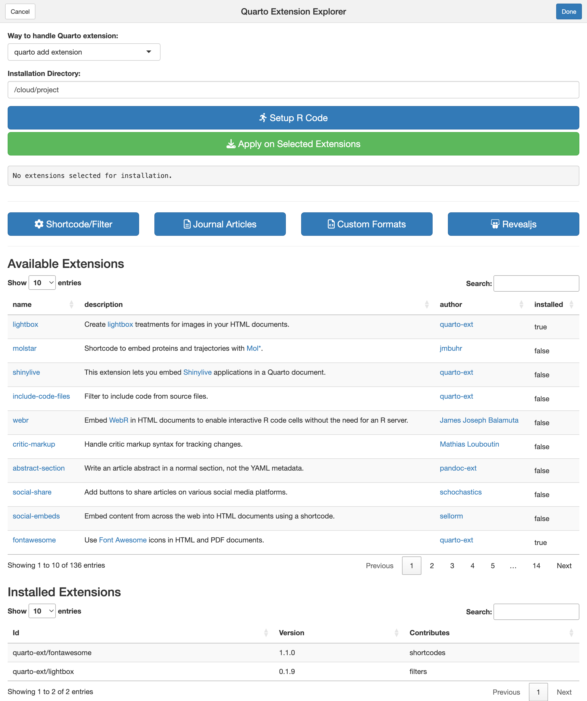

# quarto-extension-explorer

<!-- badges: start -->
<!-- badges: end -->

The goal of quartoextexp is to provide a Shiny gadget to explore the extensions available from the official [Quarto Extension Listing](https://quarto.org/docs/extensions/) and easily add one or more of them into a Quarto project.

## Installation

You can install the development version of quartoextexp from [GitHub](https://github.com/) with:

``` r
# install.packages("devtools")
devtools::install_github("parmsam/quarto-extension-explorer")
```

## Example

This is a basic example which shows you how to run the app (pointing to your working directory). Note that you should point it to your Quarto project directory not your `_extensions` folder.

``` r
library(quartoextexp)
## basic example code
quartoextexp::run_app()
```

You can change the default installation directory by providing the `install_dir` argument. You can do it like this:

```r 
quartoextexp::run_app(install_dir = "path/to/your/quarto-project")
```


After installing it, you should see `quartoextexp` in the RStudio Addins menu. Click on it to launch the Shiny app. 


You can select one or more extensions in the **Available Extensions** data table then click `Setup R Code` to generate the R code to apply on the selected extensions to your Quarto project. Then you can click `Apply on Selected Extensions` to run the R code you generated. By default all of the extensions in the Quarto Extension Listing will appear in the Avaiable Extensions data table. You can click on the Extension category buttons to filter the data table down (for example by Journal Articles or Revealjs). 


You can see your installed extensions in the **Installed Extensions** data table. You can manage each installed extension by clicking on the extension in this table and changing the mode from add extension to update or remove. Then you can setup your R code again and apply it on the selected extensions.



